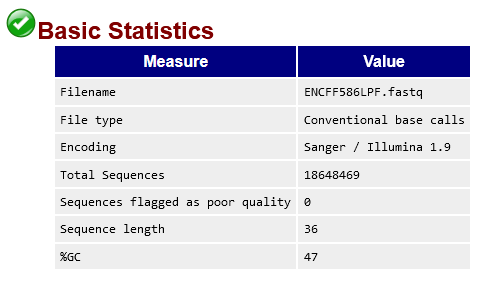

# hse_hw2_chip

[Colab](https://colab.research.google.com/drive/1yrSIKxwUNcYW2w9UEOMy4U44GVW4w46Z?usp=sharing)

Для исследования была выбрана клеточная линия H1 и гистоновая метка H3K9ac.

## Анализ FastQC

HTML-выдача FastQC лежит в data

1-ая ChipSeq реплика | 2-ая ChipSeq реплика | Контроль
--- | --- | ---
[ENCFF779MAL](data/ENCFF779MAL_fastqc.html) | [ENCFF586LPF](data/ENCFF586LPF_fastqc.html) | [ENCFF835IOE](data/ENCFF835IOE_fastqc.html)

### FastQC

ENCFF779MAL | ENCFF586LPF | ENCFF835IOE
--- | --- | ---
 |  |  
 |  |  
 | |  
 |  |  
 |  |  
 |  |  

## Таблица со статистикой по выравниванию на 16 хромосому

index | Общее число ридов | Выровнившиеся уникально | Выровнившиеся уникально (%) | Выровнившиеся неуникально | Выровнившиеся неуникально (%) | Не выровнившиеся | Не выровнившиеся (%)
--- | --- | --- | --- | --- | --- | --- | ---
ENCFF779MAL | 19964823 | 717197 | 3.59% | 2659530 | 13.32% | 16588096 | 83.09%
ENCFF586LPF | 18648469 | 754419 | 4.05% | 2249723 | 12.06% | 15644327 | 83.89%
ENCFF835IOE | 13603127 | 343054 | 2.52% | 733708 | 5.39% | 12526365 | 92.08%

## Диаграммы Эйлера-Венна

### Пересечение пиков 1 реплики и ENCODE

1 реплика с ENCODE | ENCODE с 1 репликой
--- | ---
 | 

### Пересечение пиков 2 реплики и ENCODE

2 реплика с ENCODE | ENCODE и 2 репликой
--- | ---
 | 

Пересечений довольно мало, это связано с тем, что выравнивание производилось только на одну хромосому. В базе данных ENCODE пики составлены для всех хромосом, поэтому их намного больше. Пересечение наших пиков с ENCODE и пересечение ENCODE с нашими пиками - разные вещи, в связи с чем и наблюдаются различные значения.
